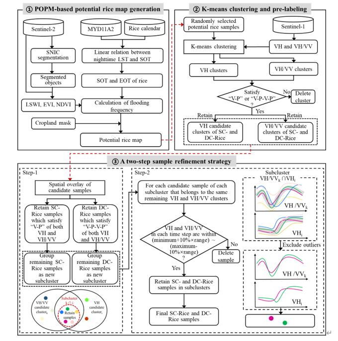

# An automated sample generation method by integrating phenology domain optical-SAR features in rice cropping pattern mapping
This is an official implementation of POSTAR method in our paper: An automated sample generation method by integrating phenology domain optical-SAR features in rice cropping pattern mapping

The workflow of POSTAR  mainly included three procedures: 
(1) a potential rice map was generated using the phenology- and object-based paddy rice mapping (POPM) method based on S-2 data, from which object-based potential rice samples were randomly selected; 
(2) K-means clustering was applied to extract distinctive clusters of potential rice samples from S-1 VH and VH/VV. Then, these clusters were prelabeled as SC-Rice and DC-Rice candidate clusters following the unique SAR semantic cues of SC-Rice and DC-Rice. 
(3) A two-step refinement strategy was utilized to purify rice candidate clusters and finally generate SC-Rice and DC-Rice samples with high confidence by considering intraclass phenological variance and sample purity. 

GEE_code/01-PPPM corrosponding to GEE code for Step 1;
GEE_code/02-Export SAR data corrosponding to GEE code for exporting VH and VH/VV time series of potential rice samples;
Two-step refinement strategy/TwoStep_Refinement_Strategy corrosponding to python code for Step3, ;
